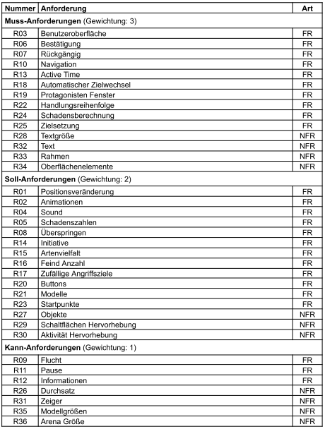

# unity-active-time-battle-system-demo

Adapted demo of Square Enix's active time battle system created in Unity.

## Features

### Game:
- Damage calculation with resistances and advantages
- Sound system for music and sound effects
- Functional menu system
- Command input persistence
- Various attack types
- Coordinated movement sequences
- Independent decision-making by the opponent
- Pause with the game loop restarting
- A function to escape from combat
- Status system to maintain combat order

### Animations:
- Idle
- Walking
- Attacking
- Being Hit
- Dying
- Casting Spells
- Spells
- Spell Hits
- Menu

## Tech Stack 🛠️

### Languages 💻

### Frameworks & Platforms ⚙️

### Developer Tools 🧰

## Requirements analysis

## Demo

## Gameplay Demo

